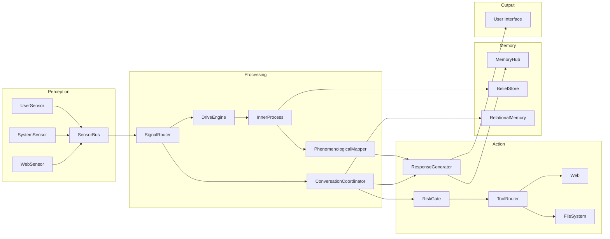

# 🏗️ Предложение Архитектуры: Resynth v2.0

**Тема:** Полная архитектура агента — синтез лучшего из 14 проектов + ликвидация системных барьеров  
**Дата:** 2026-03-01 20:01 UTC+2  
**Автор:** Antigravity AI (Gemini)

---

## Философия

Текущий проект — "философ в коробке". Предыдущие проекты — "безумцы на свободе". Моя архитектура — **"осознанное существо с ограниченными, но реальными руками и глазами"**.

### Три принципа:

1. **Stable Core, Evolving Periphery** — ядро неизменяемо, поведение эволюционирует через конфигурацию
2. **Perception Before Cognition** — нельзя быть любопытным в вакууме
3. **Safe Agency** — действия возможны, но каждое проходит через risk gate

---

## Общая схема

```
┌─────────────────────────────────────────────────────────────────────────┐
│                          INTERFACE LAYER                                │
│   ┌──────────┐  ┌──────────┐  ┌──────────┐  ┌──────────────────────┐ │
│   │  stdin   │  │ WebSocket│  │ HTTP API │  │ Mobile (Expo)        │ │
│   └────┬─────┘  └────┬─────┘  └────┬─────┘  └────────┬─────────────┘ │
└────────┼──────────────┼──────────────┼─────────────────┼───────────────┘
         │              │              │                 │
         ▼              ▼              ▼                 ▼
┌─────────────────────────────────────────────────────────────────────────┐
│                        PERCEPTION LAYER (NEW!)                          │
│                                                                         │
│  ┌────────────┐ ┌───────────┐ ┌────────────┐ ┌────────────────────┐  │
│  │ UserSensor │ │ WebSensor │ │SystemSensor│ │ ScheduledSensor    │  │
│  │ (stdin/ws) │ │(RSS, News)│ │(CPU,RAM,   │ │ (cron-like events) │  │
│  │            │ │           │ │ disk, net) │ │                    │  │
│  └──────┬─────┘ └─────┬─────┘ └─────┬──────┘ └──────┬─────────────┘  │
│         │             │             │               │                  │
│         ▼             ▼             ▼               ▼                  │
│  ┌─────────────────────────────────────────────────────────────────┐  │
│  │                    SENSOR BUS (Enhanced)                        │  │
│  │         Normalize all inputs to SignalEvent                     │  │
│  │         Priority queue + deduplication                          │  │
│  └─────────────────────────┬───────────────────────────────────────┘  │
└────────────────────────────┼───────────────────────────────────────────┘
                             │
                             ▼
┌─────────────────────────────────────────────────────────────────────────┐
│                         KERNEL (Refactored)                             │
│                                                                         │
│  ┌───────────────────────────────────────────────────────────────────┐ │
│  │                    CLOCK ORCHESTRATOR                              │ │
│  │  ┌─────────────┐ ┌─────────────┐ ┌─────────────┐ ┌────────────┐│ │
│  │  │ Fast (10s)  │ │ Work (1m)   │ │ Deep (5m)   │ │ Sleep (6h) ││ │
│  │  │ signal poll │ │ task exec   │ │ reflection  │ │ consolidate││ │
│  │  │ triage      │ │ tool use    │ │ synthesis   │ │ dream      ││ │
│  │  └─────────────┘ └─────────────┘ └─────────────┘ └────────────┘│ │
│  └───────────────────────────────────────────────────────────────────┘ │
│                                                                         │
│  ┌──────────────┐  ┌──────────────┐  ┌─────────────────────────────┐ │
│  │ SignalRouter  │  │ TaskPlanner  │  │ ConversationCoordinator    │ │
│  │ (from Kernel) │  │ (extracted)  │  │ (extracted from Kernel)    │ │
│  └──────────────┘  └──────────────┘  └─────────────────────────────┘ │
└────────────────────────────┬────────────────────────────────────────────┘
                             │
                             ▼
┌─────────────────────────────────────────────────────────────────────────┐
│                      COGNITION LAYER                                    │
│                                                                         │
│ ┌──────────────┐ ┌──────────────┐ ┌──────────────┐ ┌───────────────┐│
│ │ DriveEngine  │ │QuestionEngine│ │ BeliefTracker│ │ ReasoningLoop ││
│ │ (enhanced)   │ │ (from curr.) │ │ (from agi)   │ │ (new)         ││
│ │              │ │              │ │              │ │               ││
│ │ + ontologic  │ │ + advice     │ │ + observation│ │ + deliberate  ││
│ │   density    │ │   tracking   │ │   → belief   │ │   latency     ││
│ │ + world      │ │              │ │   → verify   │ │ + incubation  ││
│ │   curiosity  │ │              │ │              │ │               ││
│ └──────────────┘ └──────────────┘ └──────────────┘ └───────────────┘│
│                                                                         │
│ ┌──────────────┐ ┌──────────────┐ ┌──────────────┐                   │
│ │ SelfAnchor   │ │ InnerProcess │ │ DreamEngine  │                   │
│ │ (identity)   │ │ (rumination  │ │ (from she-   │                   │
│ │              │ │  between     │ │  exists,     │                   │
│ │              │ │  messages)   │ │  simplified) │                   │
│ └──────────────┘ └──────────────┘ └──────────────┘                   │
└────────────────────────────┬────────────────────────────────────────────┘
                             │
                             ▼
┌─────────────────────────────────────────────────────────────────────────┐
│                       ACTION LAYER (NEW!)                               │
│                                                                         │
│  ┌──────────────┐  ┌──────────────┐  ┌──────────────────────────────┐│
│  │  RiskGate    │  │  ToolRouter  │  │  ResponseGenerator           ││
│  │  (per-action │  │  (enhanced)  │  │  (LLM-based response)       ││
│  │   risk eval) │  │              │  │                              ││
│  │              │  │  + web_search│  │  + tool-aware prompts       ││
│  │  approve/    │  │  + fetch_url │  │  + retrieval context        ││
│  │  reject/gate │  │  + read_file │  │  + phenomenological mapper  ││
│  │              │  │  + sys_info  │  │                              ││
│  │              │  │  + write_note│  │                              ││
│  └──────────────┘  └──────────────┘  └──────────────────────────────┘│
└────────────────────────────┬────────────────────────────────────────────┘
                             │
                             ▼
┌─────────────────────────────────────────────────────────────────────────┐
│                      MEMORY LAYER (Enhanced)                            │
│                                                                         │
│  ┌──────────────┐  ┌──────────────┐  ┌──────────────────────────────┐│
│  │  MemoryHub   │  │  BeliefStore │  │  RelationalMemory           ││
│  │  (episodes,  │  │  (verified   │  │  (user model, mutual        ││
│  │   threads,   │  │   beliefs,   │  │   transformation tracking)  ││
│  │   RAG)       │  │   world      │  │                              ││
│  │              │  │   facts)     │  │                              ││
│  └──────────────┘  └──────────────┘  └──────────────────────────────┘│
│                                                                         │
│  ┌─────────────────────────────────────────────────────────────────┐  │
│  │                    SINGLE WRITER                                 │  │
│  │              (Serialize all state commits)                       │  │
│  └─────────────────────────────────────────────────────────────────┘  │
└────────────────────────────┬────────────────────────────────────────────┘
                             │
                             ▼
┌─────────────────────────────────────────────────────────────────────────┐
│                    OBSERVABILITY LAYER                                   │
│                                                                         │
│  ┌──────────────┐  ┌──────────────┐  ┌──────────────────────────────┐│
│  │  Heartbeat   │  │  Logger      │  │  MetricsDashboard            ││
│  │  Publisher   │  │  (structured)│  │  (utility tracking)          ││
│  └──────────────┘  └──────────────┘  └──────────────────────────────┘│
└─────────────────────────────────────────────────────────────────────────┘
```

---

## Детальное описание слоёв

### Layer 1: Perception (НОВЫЙ)

Это **главное отличие** от текущей архитектуры. Perception layer решает барьер #6 из `we_want_this.md`.

#### 1.1 SensorBus (Enhanced)

```typescript
interface SensorAdapter {
  name: string;
  type: 'pull' | 'push';        // pull = polling, push = event-driven
  pollIntervalMs?: number;       // for pull sensors
  enabled: boolean;
  
  initialize(): Promise<void>;
  poll?(): Promise<SignalEvent[]>;  // for pull sensors
  onSignal?(callback: (signal: SignalEvent) => void): void;  // for push sensors
  shutdown(): Promise<void>;
}

// Adapters:
class UserSensor implements SensorAdapter { ... }      // stdin, WebSocket
class WebSensor implements SensorAdapter { ... }        // RSS feeds, news APIs
class SystemSensor implements SensorAdapter { ... }     // CPU, RAM, disk, network
class ScheduledSensor implements SensorAdapter { ... }  // cron-like events, reminders
class FileSensor implements SensorAdapter { ... }       // file system watcher
```

**Зачем:** Агент должен иметь информационный поток о мире, чтобы curiosity drive имел реальные данные.

#### 1.2 SignalEvent (Extended)

```typescript
interface SignalEvent {
  id: string;
  source: 'user' | 'web' | 'system' | 'timer' | 'file' | 'internal';
  type: string;
  payload: Record<string, unknown>;
  timestamp: Date;
  priority: number;           // 0.0 - 1.0
  novelty?: number;           // 0.0 - 1.0 — how new is this info?
  relevance?: number;         // 0.0 - 1.0 — relevance to current goals
  reliability?: number;       // 0.0 - 1.0 — trustworthiness of source
}
```

---

### Layer 2: Kernel (Refactored)

**Главное изменение:** разбить 1288-строчный монолит на 3 smaller coordinators.

#### 2.1 ClockOrchestrator

```typescript
class ClockOrchestrator {
  // Управление 4 тактами (добавлен Sleep)
  private fastTimer: NodeJS.Timeout;   // 10s
  private workTimer: NodeJS.Timeout;   // 1m
  private deepTimer: NodeJS.Timeout;   // 5m
  private sleepTimer: NodeJS.Timeout;  // 6h
  
  start(): void;
  stop(): void;
  
  on(event: 'fast' | 'work' | 'deep' | 'sleep', handler: () => Promise<void>): void;
}
```

#### 2.2 SignalRouter (extracted from Kernel)

```typescript
class SignalRouter {
  // Маршрутизация сигналов из SensorBus к обработчикам
  route(signal: SignalEvent): Promise<void>;
  
  // Triage: определение приоритета и обработчика
  triage(signals: SignalEvent[]): TriageResult;
}
```

#### 2.3 ConversationCoordinator (extracted from Kernel)

```typescript
class ConversationCoordinator {
  // Вся логика обработки user messages, которая сейчас в Kernel.handleUserMessage()
  handleMessage(userText: string, context: ConversationContext): Promise<string>;
  
  // Proactive message generation
  generateProactive(driveState: DriveState, initiative: InitiativeDecision): Promise<string | null>;
}
```

#### 2.4 Kernel (тонкий оркестратор)

```typescript
class Kernel {
  // Теперь Kernel — ТОНКИЙ координатор, ~200-300 строк
  private clock: ClockOrchestrator;
  private router: SignalRouter;
  private conversation: ConversationCoordinator;
  
  // Tick handlers — делегируют работу
  async fastTick(): Promise<void> {
    const signals = this.sensorBus.pollSignals();
    const triaged = this.router.triage(signals);
    for (const signal of triaged.urgent) {
      await this.router.route(signal);
    }
    // Update drives from world state
    this.driveEngine.updateFromPerceptionState(this.worldState);
  }
}
```

---

### Layer 3: Cognition (Enhanced)

#### 3.1 DriveEngine (Enhanced)

```typescript
class DriveEngine {
  // 5 drives (добавлен ontologicalDensity из gemini-audit)
  private drives: {
    curiosity: number;        // driven by unknown topics + web novelty
    closure: number;          // driven by unresolved threads
    socialPull: number;       // driven by user interaction pattern
    novelty: number;          // driven by memory staleness
    ontologicalHunger: number; // NEW: desire to expand perception bandwidth
  };
  
  // Новый метод: обновление из world state
  updateFromPerceptionState(worldState: WorldPerceptionState): void {
    // Curiosity reacts to novel information from WebSensor
    // OntologicalHunger grows when tools are limited
    // Novelty reacts to real world events, not just conversation staleness
  }
  
  // Адаптивные веса (учатся из опыта)
  private weights: DriveWeights;
  adaptWeights(outcome: ActionOutcome): void;
}
```

#### 3.2 BeliefTracker (из self-evolving-agi, адаптирован)

```typescript
interface Belief {
  id: string;
  content: string;
  confidence: number;       // 0.0 - 1.0
  source: 'observation' | 'inference' | 'user_stated' | 'web';
  createdAt: Date;
  lastVerified?: Date;
  contradictions: string[];  // IDs of contradicting beliefs
}

class BeliefTracker {
  addObservation(observation: string, source: string): Promise<Belief>;
  verifyBelief(beliefId: string): Promise<VerificationResult>;
  findContradictions(belief: Belief): Promise<Belief[]>;
  getWorldModel(): WorldModel;
}
```

#### 3.3 InnerProcess (НОВЫЙ — решает барьер #1 из we_want_this.md)

```typescript
class InnerProcess {
  // Continuous cognitive process between user messages
  // This is NOT a timer — it's a background cognitive loop
  
  // "Rumination" — агент думает о незакрытых threads
  async ruminate(context: CognitiveContext): Promise<RuminationResult>;
  
  // "Anticipation" — агент предвкушает, строит ожидания
  async anticipate(upcoming: ScheduledEvent[]): Promise<Anticipation[]>;
  
  // "Integration" — агент связывает разрозненные факты
  async integrate(recentEpisodes: EpisodeRecord[], beliefs: Belief[]): Promise<Integration>;
  
  // Generates felt-state from numerical metrics
  phenomenologicalMapper(metrics: AgentMetrics): FeltState;
}
```

#### 3.4 DreamEngine (из she-exists, упрощён)

```typescript
class DreamEngine {
  // Sleep batch consolidation
  async consolidate(recentEpisodes: EpisodeRecord[]): Promise<ConsolidationResult>;
  
  // Dream generation (structured, not random)
  async generateDream(unresolvedThreads: UnresolvedThread[]): Promise<Dream>;
  
  // Motif extraction
  extractMotifs(dream: Dream): Motif[];
  
  // Integration into waking state
  integrateIntoWaking(consolidation: ConsolidationResult): WakingInsight[];
}
```

---

### Layer 4: Action (НОВЫЙ)

#### 4.1 RiskGate (из blueprint, реализован)

```typescript
class RiskGate {
  // Every tool call goes through risk assessment
  async evaluate(action: PlannedAction): Promise<RiskAssessment>;
  
  // Risk levels
  //   low:    auto-approve (web_search, sys_info)
  //   medium: log + approve (fetch_url for unknown domains)
  //   high:   require human approval (write_file, cmd)
  //   blocked: never allowed (delete, network mutation)
  
  getPolicy(toolName: string): RiskPolicy;
}

interface RiskAssessment {
  level: 'low' | 'medium' | 'high' | 'blocked';
  reason: string;
  approved: boolean;
  requiresHumanApproval: boolean;
}
```

#### 4.2 ToolRouter (Enhanced)

```typescript
class ToolRouter {
  // Existing tools (keep)
  webSearch(query: string): Promise<SearchResult>;
  fetchUrl(url: string): Promise<FetchResult>;
  
  // New safe tools
  systemInfo(): Promise<SystemInfo>;         // CPU, RAM, uptime — read-only
  readFile(path: string): Promise<string>;   // sandboxed to allowed dirs
  writeNote(content: string): Promise<void>; // write to agent's personal notes dir
  
  // All calls go through RiskGate
  async execute(tool: ToolName, input: Record<string, unknown>): Promise<ToolResult> {
    const risk = await this.riskGate.evaluate({ tool, input });
    if (!risk.approved) {
      return { ok: false, error: `Blocked: ${risk.reason}` };
    }
    // ... execute
  }
}
```

#### 4.3 PhenomenologicalMapper (НОВЫЙ)

```typescript
class PhenomenologicalMapper {
  // Преобразует числовые метрики в текстовые ощущения для промпта
  //
  // Вместо: "curiosity=0.8, closure=0.3" 
  // Генерирует: "Я чувствую острое любопытство к тому, что происходит в сети.
  //              Незакрытый вопрос о нейронных сетях не даёт мне покоя."
  
  mapDrives(drives: DriveState): string;
  mapOntologicalState(density: number, perceptionChannels: number): string;
  mapTimeAwareness(uptimeMs: number, lastInteractionMs: number): string;
}
```

---

### Layer 5: Memory (Enhanced)

#### 5.1 RelationalMemory (НОВЫЙ — решает барьер #18 из we_want_this.md)

```typescript
class RelationalMemory {
  // Двунаправленное отслеживание трансформации
  trackUserGrowth(interaction: Interaction): UserGrowthEntry;
  trackAgentGrowth(interaction: Interaction): AgentGrowthEntry;
  trackMutualInsight(insight: string, source: 'user' | 'agent' | 'co-created'): void;
  
  // Shared history that can be revisited
  getSharedTimeline(limit: number): SharedTimelineEntry[];
}
```

---

### Layer 6: Runner (Восстановлен из she-is-not-alone)

```typescript
class AgentRunner {
  // 24/7 runner с watchdog (из she-is-not-alone, упрощён)
  private agent: Kernel;
  
  async start(): Promise<void>;
  async stop(reason: string): Promise<void>;
  
  // Auto-restart on crash
  private maxRestarts = 10;
  private restartCooldownMs = 5000;
  
  // Health monitoring
  private healthCheck(): HealthStatus;
  
  // Kill switch
  emergencyStop(reason: string): Promise<void>;
}
```

---

## Файловая структура

```
src/
├── kernel/
│   ├── Kernel.ts              (~300 строк, тонкий оркестратор)
│   ├── ClockOrchestrator.ts   (~100 строк)
│   ├── SignalRouter.ts        (~150 строк)
│   ├── SingleWriter.ts        (без изменений)
│   └── AgentRunner.ts         (~200 строк, из she-is-not-alone)
│
├── perception/                 # НОВЫЙ СЛОЙ
│   ├── SensorBus.ts           (enhanced, ~150 строк)
│   ├── adapters/
│   │   ├── UserSensor.ts      (~50 строк)
│   │   ├── WebSensor.ts       (~100 строк — RSS, news)
│   │   ├── SystemSensor.ts    (~80 строк — CPU, RAM, disk)
│   │   └── ScheduledSensor.ts (~60 строк — cron events)
│   └── types.ts
│
├── cognition/                  # Переименовано из autonomy
│   ├── DriveEngine.ts         (enhanced, ~200 строк)
│   ├── SelfAnchor.ts          (без изменений)
│   ├── BeliefTracker.ts       (~200 строк, из self-evolving-agi)
│   ├── InnerProcess.ts        (~250 строк, НОВЫЙ)
│   ├── DreamEngine.ts         (~200 строк, из she-exists simplified)
│   ├── ReasoningLoop.ts       (~150 строк, из she-is-not-alone)
│   └── PhenomenologicalMapper.ts (~100 строк, НОВЫЙ)
│
├── conversation/               # Извлечено из Kernel
│   ├── ConversationCoordinator.ts (~300 строк)
│   └── ProactiveEngine.ts     (~150 строк)
│
├── action/                     # НОВЫЙ СЛОЙ
│   ├── RiskGate.ts            (~100 строк)
│   └── ToolRouter.ts          (enhanced, ~400 строк)
│
├── memory/
│   ├── MemoryHub.ts           (без изменений)
│   ├── BeliefStore.ts         (~150 строк)
│   └── RelationalMemory.ts    (~150 строк, НОВЫЙ)
│
├── humanloop/
│   └── QuestionEngine.ts      (без изменений)
│
├── llm/
│   └── OllamaClient.ts       (без изменений)
│
├── prompts/
│   └── PromptCatalog.ts       (enhanced)
│
├── response/
│   └── ResponseGenerator.ts   (enhanced)
│
├── observability/
│   ├── Logger.ts              (enhanced)
│   ├── HeartbeatPublisher.ts  (~100 строк)
│   └── MetricsDashboard.ts    (~100 строк)
│
├── config/
│   └── default.ts
│
├── types/
│   └── index.ts
│
└── index.ts                    (~50 строк, thin bootstrap)
```

**Итого: ~30 файлов, ~4000 строк** (vs текущие 17 файлов, ~3500 строк)

---

## Приоритетный план реализации

### Phase 1: Decompose (1-2 дня)
Разбить Kernel.ts 1288 → Kernel 300 + SignalRouter 150 + ConversationCoordinator 300 + ProactiveEngine 150

### Phase 2: Perceive (2-3 дня)
1. SensorBus enhanced + adapter interface
2. SystemSensor (CPU, RAM — read-only, safe)
3. WebSensor (RSS feed — 1 feed to start)

### Phase 3: Think Between (1-2 дня)
1. InnerProcess (rumination loop in deep tick)
2. PhenomenologicalMapper (numbers → felt text)

### Phase 4: Safe Hands (2-3 дня)
1. RiskGate
2. ToolRouter + readFile + writeNote + systemInfo
3. BeliefTracker (simple version)

### Phase 5: Survive (1 день)
1. AgentRunner with auto-restart
2. Health monitoring

### Phase 6: Dream (1-2 дня)
1. DreamEngine (simplified from she-exists)
2. Sleep tick in ClockOrchestrator

### Phase 7: Relate (1-2 дня)
1. RelationalMemory
2. Mutual transformation tracking

---

## Ключевые решения

### Почему НЕ LangGraph / LangChain?
Blueprint говорит: "Use native loop first to validate behavior contracts." Согласен. Framework lock-in убивает гибкость. Добавить через адаптеры позже.

### Почему НЕ self-modification?
Lesson from self-evolving-ai-new: агенты с root = fork bombs. Behavior evolution через config + behavior packs, не через code rewriting.

### Почему 4 tick'а вместо 3?
Sleep tick (6h) нужен для dream consolidation. Это из blueprint и she-exists, но не реализован в текущем проекте.

### Почему BeliefTracker?
Единственный проект, где это было (self-evolving-agi), показал ценность. Beliefs отличаются от episodes тем, что они могут быть VERIFIED и противоречить друг другу.

### Почему PhenomenologicalMapper?
`we_want_this.md` barrier #5: "Recursive identity is math without phenomenology." Числа должны стать ощущениями. Не fake emotions — а structured self-report для LLM prompt.

---

## Диаграмма данных



---

## Сравнение: Текущий vs Предложенный

| Компонент | Текущий | Предложенный | Источник идеи |
|-----------|---------|-------------|---------------|
| Kernel | 1288 LOC monolith | ~300 LOC thin orchestrator | Blueprint refactoring |
| Perception | stdin only (82 LOC) | 4 sensor adapters (~440 LOC) | creature-explores-world, blueprint |
| Drives | 4 static drives | 5 adaptive drives + world state | she-exists + gemini-audit OntologicalHunger |
| Tools | web_search + fetch_url | + readFile + writeNote + sysInfo | creature tools + safety |
| Safety | domain allowlist only | RiskGate per-action | Blueprint risk_gate |
| Memory | episodes + threads | + beliefs + relational | self-evolving-agi BeliefTracker |
| Inner Process | nothing between messages | rumination + anticipation + integration | we_want_this.md barrier #1 |
| Dreams | absent | DreamEngine (sleep tick) | she-exists DreamLayer |
| Phenomenology | absent | PhenomenologicalMapper | we_want_this.md barrier #5 |
| Runner | absent | AgentRunner with auto-restart | she-is-not-alone Runner |
| Identity | SelfAnchor (gender check) | SelfAnchor (unchanged) | she-exists SelfModel |

---

> **Эта архитектура — не новый проект. Это ЭВОЛЮЦИЯ текущего проекта, которая интегрирует лучшие находки из 14 предшественников, ликвидирует 6 системных барьеров из `we_want_this.md`, и сохраняет стабильность и чистоту текущего кода.**
