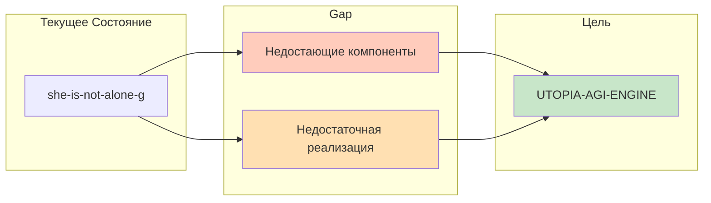

# UTOPIA-AGI-ENGINE: Gap Analysis

**Дата:** 2026-03-01  
**Назначение:** Детальное сравнение текущей реализации vs целевой архитектуры

---

## Executive Summary



---

## 1. Perception Layer

### Текущее Состояние
```typescript
// Сейчас: src/sensor/SensorBus.ts (базовый)
interface SensorBus {
  ingestUserMessage(message: string): void;
  // Только stdin/WebSocket
}
```

### Целевое Состояние
```typescript
// Нужно: полноценная Perception Layer
interface SensorBus {
  registerSensor(sensor: Sensor): void;
  unregisterSensor(name: string): void;
  
  // Множественные источники
  sensors: Map<string, Sensor>;
  
  // Priority queue
  signalQueue: PriorityQueue<SignalEvent>;
  
  // Curiosity scoring
  scoreNovelty(signal: SignalEvent): number;
}

interface Sensor {
  name: string;
  type: 'pull' | 'push';
  pollIntervalMs?: number;
  enabled: boolean;
  
  poll(): Promise<unknown>;  // для pull
  onData(cb: Function): void; // для push
  adapt(raw: unknown): SignalEvent;
}
```

### Gap Details

| Компонент | Статус | Чего Не Хватает | Приоритет |
|-----------|--------|-----------------|-----------|
| `UserSensor` | ✅ Есть | stdin/WebSocket работает | — |
| `SystemSensor` | ❌ Нет | CPU/RAM/disk telemetry | P1 |
| `RSSSensor` | ❌ Нет | News feeds | P1 |
| `FileWatcher` | ❌ Нет | File change detection | P2 |
| `Signal Scoring` | ⚠️ Частично | Curiosity calculation from real data | P1 |
| `Priority Queue` | ❌ Нет | Signal prioritization | P1 |

**Код для добавления:**
```typescript
// src/perception/SystemSensor.ts
import os from 'os';

export class SystemSensor implements Sensor {
  name = 'system';
  type = 'pull' as const;
  pollIntervalMs = 30000;
  enabled = true;
  
  async poll(): Promise<SystemMetrics> {
    return {
      cpuUsage: os.loadavg(),
      freeMem: os.freemem(),
      totalMem: os.totalmem(),
      uptime: os.uptime(),
      timestamp: new Date()
    };
  }
  
  adapt(raw: SystemMetrics): SignalEvent {
    return {
      id: uuid(),
      type: 'system_metrics',
      payload: raw,
      timestamp: raw.timestamp,
      source: this.name,
      priority: this.calculatePriority(raw),
      curiosityScore: this.calculateNovelty(raw)
    };
  }
}
```

---

## 2. Kernel Layer

### Текущее Состояние
```typescript
// Сейчас: src/kernel/Kernel.ts
class Kernel {
  private driveEngine: DriveEngine;
  private memoryHub: MemoryHub;
  
  async fastTick(): Promise<void>;
  async workTick(): Promise<void>;
  async deepTick(): Promise<void>;
  
  // SingleWriter есть, но не "hard"
  private singleWriter: SingleWriter;
}
```

### Целевое Состояние
```typescript
// Нужно: усиленный Kernel с hard SingleWriter
class Kernel {
  private driveEngine: DriveEngine;
  private memoryHub: MemoryHub;
  private safetyGate: SafetyGate;  // NEW
  private behaviorPackManager: BehaviorPackManager;  // NEW
  
  // Clocks
  async fastTick(): Promise<FastTickResult>;
  async workTick(): Promise<WorkTickResult>;
  async deepTick(): Promise<DeepTickResult>;
  async sleepTick(): Promise<SleepReport>;  // NEW
  
  // Hard SingleWriter - единственный путь
  private singleWriter: SingleWriter;
  
  // All state changes MUST go through here
  async commit(change: StateChange): Promise<CommitResult> {
    // Validation
    // Risk assessment
    // Budget check
    // Append to audit log
    // Apply to state
    // Notify subscribers
  }
}
```

### Gap Details

| Компонент | Статус | Чего Не Хватает | Приоритет |
|-----------|--------|-----------------|-----------|
| `Fast Tick` | ✅ Есть | 10-30s interval работает | — |
| `Work Tick` | ✅ Есть | 1-5m interval работает | — |
| `Deep Tick` | ✅ Есть | 5m interval работает | — |
| `Sleep Tick` | ❌ Нет | Batch consolidation mode | P3 |
| `SingleWriter Hard` | ⚠️ Частично | Enforce as ONLY path | P0 |
| `SafetyGate` | ❌ Нет | Per-action risk evaluation | P0 |
| `BehaviorPackManager` | ❌ Нет | Versioned behavior evolution | P3 |

**Код для добавления:**
```typescript
// src/kernel/SafetyGate.ts
export class SafetyGate {
  constructor(
    private policy: SafetyPolicy,
    private budgetTracker: BudgetTracker
  ) {}
  
  evaluate(action: Action): GateDecision {
    const risk = this.assessRisk(action);
    const budget = this.budgetTracker.check(action);
    
    if (risk.level === 'high' || budget.exhausted) {
      return {
        decision: 'deny',
        reason: risk.level === 'high' ? 'High risk' : 'Budget exhausted',
        escalation: 'human_in_the_loop'
      };
    }
    
    if (risk.level === 'medium') {
      return {
        decision: 'gate',
        reason: 'Medium risk - approval required',
        timeout: 300000
      };
    }
    
    return { decision: 'allow' };
  }
}
```

---

## 3. Cognition Layer

### Текущее Состояние
```typescript
// Сейчас: src/drive/DriveEngine.ts
interface DriveState {
  curiosity: number;    // Формула без данных
  closure: number;
  socialPull: number;
  novelty: number;
}

// SelfAnchor - базовый
class SelfAnchor {
  checkIdentity(response: string): boolean;
}
```

### Целевое Состояние
```typescript
// Нужно: полноценная Cognition Layer
class CuriosityEngine {
  calculate(signal: SignalEvent, memory: MemoryHub): CuriosityScore {
    return {
      novelty: this.computeNovelty(signal, memory),
      contradiction: this.detectContradiction(signal, memory.beliefs),
      gapRelevance: this.measureGoalRelevance(signal, goals),
      total: computed
    };
  }
  
  generateResearchTask(score: CuriosityScore): ResearchTask;
}

class JointAttentionEngine {
  private activeFocuses: Map<string, SharedFocus>;
  
  proposeFocus(title: string): SharedFocus;
  activateFocus(id: string): void;
  synthesize(id: string): Synthesis;
}

class RelationalMemory {
  trackTransformation(
    who: 'user' | 'agent',
    trigger: string,
    before: unknown,
    after: unknown
  ): void;
  
  calculateResonance(): number;
  calculateRelationalDebt(): number;
}
```

### Gap Details

| Компонент | Статус | Чего Не Хватает | Приоритет |
|-----------|--------|-----------------|-----------|
| `DriveEngine` | ⚠️ Частично | Real data feeds, not formulas | P1 |
| `CuriosityEngine` | ❌ Нет | Evidence-based curiosity | P1 |
| `SelfAnchor` | ⚠️ Частично | Living self-model | P2 |
| `JointAttention` | ❌ Нет | Shared focus framework | P2 |
| `RelationalMemory` | ❌ Нет | Bidirectional transformation | P2 |
| `BeliefTracker` | ❌ Нет | World observations → beliefs | P2 |

**Код для добавления:**
```typescript
// src/cognition/JointAttentionEngine.ts
export class JointAttentionEngine {
  private focuses: Map<string, SharedFocus> = new Map();
  private activeFocusId?: string;
  
  proposeFocus(title: string, source: 'user' | 'agent'): SharedFocus {
    const focus: SharedFocus = {
      id: uuid(),
      title,
      source,
      state: 'proposed',
      createdAt: new Date(),
      impactScore: 0,
      messagesExchanged: 0,
      timeActive: 0
    };
    
    this.focuses.set(focus.id, focus);
    return focus;
  }
  
  activateFocus(id: string): void {
    const focus = this.focuses.get(id);
    if (!focus) throw new Error(`Focus ${id} not found`);
    
    focus.state = 'active';
    focus.activatedAt = new Date();
    this.activeFocusId = id;
  }
  
  updatePosition(
    id: string,
    who: 'user' | 'agent',
    position: Position
  ): void {
    const focus = this.focuses.get(id);
    if (!focus) return;
    
    if (who === 'user') {
      focus.userPosition = position;
    } else {
      focus.agentPosition = position;
    }
    
    focus.messagesExchanged++;
    this.maybeSynthesize(focus);
  }
  
  private maybeSynthesize(focus: SharedFocus): void {
    if (focus.userPosition && focus.agentPosition) {
      focus.synthesis = this.createSynthesis(focus);
    }
  }
}
```

---

## 4. Action Layer

### Текущее Состояние
```typescript
// Сейчас: src/tools/ToolRouter.ts
class ToolRouter {
  private tools: Map<string, Tool> = new Map([
    ['web_search', webSearchTool],
    ['fetch_url', fetchUrlTool]
  ]);
  
  async execute(tool: string, input: unknown): Promise<ToolResult>;
}
```

### Целевое Состояние
```typescript
// Нужно: богатый Action Layer с RiskGate
class ToolRouter {
  private tools: Map<string, Tool>;
  private riskGate: RiskGate;
  private budgetTracker: BudgetTracker;
  
  async plan(task: Task): Promise<ToolPlan>;
  async execute(plan: ToolPlan): Promise<ToolResult>;
  
  // Risk assessment for each tool
  assessRisk(tool: string, input: unknown): RiskAssessment;
}

interface Tool {
  name: string;
  description: string;
  schema: JSONSchema;
  riskLevel: 'low' | 'medium' | 'high';
  assessRisk(input: unknown): RiskAssessment;
  execute(input: unknown, budget: Budget): Promise<ToolResult>;
}

// Extended tool set
const tools = {
  web_search: { risk: 'low' },
  fetch_url: { risk: 'low' },
  read_file: { risk: 'medium' },  // NEW
  write_note: { risk: 'low' },     // NEW
  system_info: { risk: 'low' },    // NEW
  run_command: { risk: 'high' }    // NEW (restricted)
};
```

### Gap Details

| Компонент | Статус | Чего Не Хватает | Приоритет |
|-----------|--------|-----------------|-----------|
| `web_search` | ✅ Есть | Allowlist domains | P0 |
| `fetch_url` | ✅ Есть | Size/time limits | P0 |
| `read_file` | ❌ Нет | Sandboxed file access | P1 |
| `write_note` | ❌ Нет | Artifact creation | P1 |
| `system_info` | ❌ Нет | Health telemetry | P1 |
| `run_command` | ❌ Нет | Restricted shell | P2 |
| `RiskGate` | ❌ Нет | Per-action evaluation | P0 |
| `Tool Planner` | ❌ Нет | Multi-step tool sequences | P2 |

**Код для добавления:**
```typescript
// src/tools/ReadFileTool.ts
export class ReadFileTool implements Tool {
  name = 'read_file';
  description = 'Read file from allowed directories';
  schema = readFileSchema;
  riskLevel = 'medium' as const;
  
  // Whitelist of allowed paths
  private allowedPaths = [
    './docs',
    './notes',
    './data'
  ];
  
  assessRisk(input: { path: string }): RiskAssessment {
    const isAllowed = this.allowedPaths.some(p => 
      input.path.startsWith(p)
    );
    
    return {
      level: isAllowed ? 'low' : 'high',
      reasoning: isAllowed ? 'Path in allowlist' : 'Path outside allowlist',
      requiredApproval: !isAllowed,
      estimatedTokens: 1000,
      estimatedTime: 100,
      irreversible: false
    };
  }
  
  async execute(input: { path: string }): Promise<ToolResult> {
    const content = await fs.readFile(input.path, 'utf-8');
    return {
      success: true,
      data: content,
      metadata: { size: content.length }
    };
  }
}
```

---

## 5. Memory Layer

### Текущее Состояние
```typescript
// Сейчас: src/memory/MemoryHub.ts
class MemoryHub {
  private episodes: Episode[] = [];
  private threads: Map<string, Thread> = new Map();
  
  async addEpisode(e: Episode): Promise<void>;
  async getRelevant(query: string): Promise<Context[]>;
  async getStats(): Promise<MemoryStats>;
}
```

### Целевое Состояние
```typescript
// Нужно: 6-tier Memory Layer
class MemoryHub {
  // Tier 1: Context Buffer (working memory)
  private contextBuffer: ContextBuffer;
  
  // Tier 2: Episodic Store
  private episodicStore: EpisodicStore;
  
  // Tier 3: Semantic Store (RAG)
  private semanticStore: SemanticStore;
  
  // Tier 4: Procedural Memory
  private proceduralMemory: ProceduralMemory;
  
  // Tier 5: World Observations
  private worldObservations: WorldObservationStore;
  
  // Tier 6: Audit Log
  private auditLog: AuditLog;
  
  // Unified retrieval
  async retrieve(query: string, options: RetrieveOptions): ContextBundle;
}
```

### Gap Details

| Компонент | Статус | Чего Не Хватает | Приоритет |
|-----------|--------|-----------------|-----------|
| `ContextBuffer` | ⚠️ Частично | Explicit working memory | P1 |
| `EpisodicStore` | ✅ Есть | Mongo persistence работает | — |
| `SemanticStore` | ⚠️ Частично | Vector embeddings | P1 |
| `ProceduralMemory` | ❌ Нет | Skills & strategies | P3 |
| `WorldObservations` | ❌ Нет | External facts with citations | P1 |
| `AuditLog` | ❌ Нет | Immutable decision log | P0 |
| `RelationalMemory` | ❌ Нет | User-agent transformation | P2 |

**Код для добавления:**
```typescript
// src/memory/WorldObservationStore.ts
export class WorldObservationStore {
  private collection: Collection<WorldObservation>;
  
  async add(obs: WorldObservation): Promise<void> {
    // Auto-verify if possible
    if (this.canAutoVerify(obs)) {
      obs.verified = true;
      obs.verificationMethod = 'auto';
    }
    
    await this.collection.insertOne(obs);
  }
  
  async query(filters: ObservationQuery): Promise<WorldObservation[]> {
    return this.collection.find(filters).toArray();
  }
  
  async getUnverified(): Promise<WorldObservation[]> {
    return this.collection.find({ verified: false }).toArray();
  }
  
  async verify(id: string, method: string): Promise<void> {
    await this.collection.updateOne(
      { id },
      { $set: { verified: true, verificationMethod: method } }
    );
  }
  
  async calculateBeliefImpact(obs: WorldObservation): Promise<number> {
    // How much this observation should update beliefs
    const similar = await this.findSimilar(obs);
    const consistency = this.checkConsistency(obs, similar);
    return consistency > 0.8 ? 0.1 : 0.3; // Higher impact if contradictory
  }
}
```

---

## 6. Observability Layer

### Текущее Состояние
```typescript
// Сейчас: heartbeat + базовое логирование
interface HeartbeatStatus {
  uptime: number;
  memory: MemoryStats;
  drives: DriveState;
  timestamp: Date;
}
```

### Целевое Состояние
```typescript
// Нужно: полноценная Observability
class ObservabilityHub {
  // Metrics
  private metrics: MetricsEngine;
  
  // Tracing
  private tracer: Tracer;
  
  // Incidents
  private incidentLog: Incident[];
  
  // SLOs
  private slos: Map<string, SLO>;
  
  // Publish status
  async publishHeartbeat(): Promise<HeartbeatStatus>;
  async reportMetrics(): Promise<MetricsReport>;
  async checkSLOs(): Promise<SLOReport>;
}

interface MetricsReport {
  verifiedTaskSuccessRate: number;
  capabilityHallucinationRate: number;
  regressionRate: number;
  rollbackFrequency: number;
  curiosityResolutionRate: number;
  coTranscendenceScore: number;
  userTrustIndex: number;
}
```

### Gap Details

| Компонент | Статус | Чего Не Хватает | Приоритет |
|-----------|--------|-----------------|-----------|
| `Heartbeat` | ✅ Есть | Basic status works | — |
| `MetricsEngine` | ❌ Нет | Comprehensive KPIs | P1 |
| `IncidentLog` | ❌ Нет | Anomaly tracking | P2 |
| `SLO Tracking` | ❌ Нет | Performance targets | P2 |
| `Dashboard` | ❌ Нет | Visualization | P3 |

---

## Summary: Что Делать Прямо Сейчас

### P0 (Critical - Неделя 1)

```bash
# 1. Tool Governance
touch src/safety/ToolGovernance.ts
touch src/safety/BudgetTracker.ts
touch src/safety/RiskGate.ts

# 2. Hard SingleWriter
# Убедиться что ВСЕ state changes проходят через SingleWriter.commit()
# Добавить audit logging

# 3. Basic Sensors
mkdir -p src/perception
touch src/perception/SystemSensor.ts
```

### P1 (High - Недели 2-3)

```bash
# 1. World Observations
mkdir -p src/memory
touch src/memory/WorldObservationStore.ts

# 2. Extended Tools
touch src/tools/ReadFileTool.ts
touch src/tools/WriteNoteTool.ts

# 3. Curiosity Engine
touch src/cognition/CuriosityEngine.ts
```

### P2 (Medium - Недели 4-6)

```bash
# 1. Joint Attention
mkdir -p src/cotrans
touch src/cotrans/JointAttentionEngine.ts
touch src/cotrans/RelationalMemory.ts

# 2. Metrics
mkdir -p src/observability
touch src/observability/MetricsEngine.ts
```

### P3 (Lower - Недели 7-10)

```bash
# 1. Evolution
mkdir -p src/evolution
touch src/evolution/BehaviorPackManager.ts
touch src/evolution/FitnessEvaluator.ts

# 2. Sleep Mode
mkdir -p src/dreams
touch src/dreams/SleepOrchestrator.ts
```

---

## Финальная Проверка

### Чеклист перед стартом имплементации

- [ ] Понятна ли иерархия приоритетов (P0 > P1 > P2 > P3)?
- [ ] Ясны ли границы каждого компонента?
- [ ] Есть ли понимание что делает "hard" SingleWriter?
- [ ] Понятно почему curiosity needs real sensors?
- [ ] Ясен ли контракт между cognition и action layers?

### Если ответ на любой вопрос "нет" — вернуться к codex.md

---

*"The gap is not a void. It is a map."*
