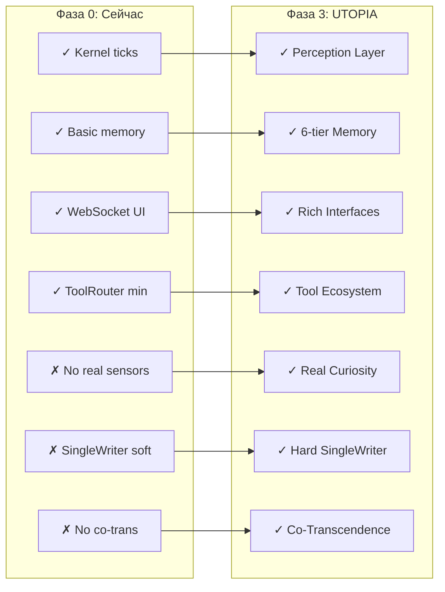
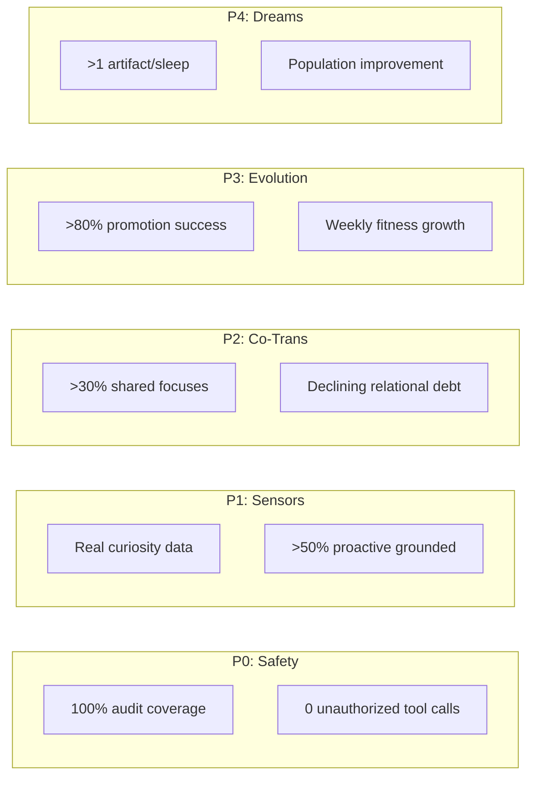

# UTOPIA-AGI-ENGINE: План Имплементации

**Дата:** 2026-03-01  
**Статус:** Живой документ — обновляется по мере прогресса  
**Цель:** Конкретные шаги от текущего состояния к UTOPIA-AGI-ENGINE

---

## Текущее Состояние vs Целевое



---

## Phase P0: Safety Foundation (Недели 1-2)

### Цель: Безопасная основа для всего остального

#### Week 1: Tool Governance

```typescript
// Новый модуль: src/safety/ToolGovernance.ts

interface ToolGovernance {
  // Allowlist доменов для web_search
  allowedDomains: string[];
  
  // Budget tracking
  budgets: {
    tokensPerHour: number;
    toolCallsPerHour: number;
    networkRequestsPerHour: number;
  };
  
  // Risk assessment
  assessToolCall(tool: string, input: unknown): RiskLevel;
  
  // Enforcement
  enforceBudgets(): boolean;
  logAllCalls(): void;
}
```

**Задачи:**
- [ ] Создать `ToolGovernance` модуль
- [ ] Добавить allowlist для `web_search` (начать с 10 доменов)
- [ ] Реализовать budget counters (in-memory + Mongo)
- [ ] Добавить middleware перед каждым tool call

**Результат:** Ни один tool call не проходит без проверки и логирования.

#### Week 2: Audit Trail & SingleWriter Hardening

```typescript
// Усиление src/kernel/SingleWriter.ts

interface Commit {
  id: string;
  type: CommitType;
  payload: unknown;
  timestamp: Date;
  origin: string;        // Какой модуль
  correlationId: string; // Для tracing
  hash: string;          // Для integrity
  signature?: string;    // Для verification
}

class SingleWriter {
  private commitLog: Commit[] = []; // Append-only
  
  async commit(c: Commit): Promise<Result> {
    // 1. Validate
    // 2. Add hash
    // 3. Append to log
    // 4. Apply to state
    // 5. Notify subscribers
    // 6. Return result
  }
  
  getAuditTrail(): Commit[] {
    return [...this.commitLog]; // Immutable copy
  }
}
```

**Задачи:**
- [ ] Сделать `SingleWriter` единственным путём для state changes
- [ ] Добавить audit log в Mongo (append-only коллекция)
- [ ] Реализовать rollback для последних N коммитов
- [ ] Добавить integrity checks (hash chain)

**Метрики успеха:**
- 100% state changes через SingleWriter
- Полная воспроизводимость любого состояния по логу

---

## Phase P1: Sensory Awakening (Недели 3-4)

### Цель: Переход от "curiosity в вакууме" к реальному любопытству

#### Week 3: Sensor Bus Architecture

```typescript
// Новый модуль: src/perception/SensorBus.ts

interface Sensor<T = unknown> {
  name: string;
  type: 'pull' | 'push';
  enabled: boolean;
  
  // Pull sensors
  pollIntervalMs?: number;
  poll(): Promise<T>;
  
  // Push sensors  
  onData(callback: (data: T) => void): void;
  
  // Normalization
  adapt(raw: T): SignalEvent;
}

class SensorBus {
  private sensors: Map<string, Sensor> = new Map();
  private signalQueue: PriorityQueue<SignalEvent>;
  
  registerSensor(s: Sensor): void;
  ingest(signal: SignalEvent): void;
  processNext(): Promise<void>;
}
```

**Имплементируем сенсоры:**

| Sensor | Type | Data | Priority |
|--------|------|------|----------|
| `UserSensor` | push | WebSocket/CLI | Critical |
| `SystemSensor` | pull (30s) | CPU, RAM, disk | Normal |
| `RSSSensor` | pull (5min) | News feeds | Background |
| `FileWatcher` | push | Configured dirs | Normal |

**Задачи:**
- [ ] Создать базовый `SensorBus`
- [ ] Реализовать `SystemSensor` (через `os` модуль Node)
- [ ] Реализовать `RSSSensor` (2-3 источника)
- [ ] Подключить к `DriveEngine` (curiosity теперь от реальных данных!)

#### Week 4: World Observation Memory

```typescript
// Расширение MemoryHub

interface WorldObservation {
  id: string;
  source: string;        // sensor name
  type: string;          // 'system_metric' | 'news_item' | 'file_change'
  data: unknown;
  timestamp: Date;
  
  // Verification
  verified: boolean;
  verificationMethod?: string;
  
  // Citations
  citations?: string[];  // Source URLs, file paths, etc.
  
  // Belief impact
  beliefDelta?: number;  // How much this changed our beliefs
}

class WorldObservationStore {
  async add(obs: WorldObservation): Promise<void>;
  async query(filters: ObservationQuery): Promise<WorldObservation[]>;
  async getUnverified(): Promise<WorldObservation[]>;
  async verify(id: string, method: string): Promise<void>;
}
```

**Задачи:**
- [ ] Создать `WorldObservationStore` (Mongo collection)
- [ ] Добавить citation tracking
- [ ] Реализовать verification workflow
- [ ] Подключить к RAG retrieval

**Метрики успеха:**
- Curiosity score основан на реальных данных
- >50% proactive messages связаны с внешними событиями

---

## Phase P2: Co-Intelligence (Недели 5-6)

### Цель: Настоящая co-transcendence вместо Q&A

#### Week 5: Joint Attention Framework

```typescript
// Новый модуль: src/cotrans/JointAttentionEngine.ts

type FocusState = 'proposed' | 'active' | 'discussed' | 'concluded' | 'archived';

interface SharedFocus {
  id: string;
  title: string;
  source: 'user' | 'agent' | 'external';
  state: FocusState;
  
  // Positions
  userPosition?: Position;
  agentPosition?: Position;
  
  // Synthesis (the "third entity")
  synthesis?: {
    content: string;
    createdAt: Date;
    acceptedBy: ('user' | 'agent')[];
  };
  
  // Metrics
  impactScore: number;
  messagesExchanged: number;
  timeActive: number;
}

class JointAttentionEngine {
  private activeFocuses: Map<string, SharedFocus> = new Map();
  
  proposeFocus(title: string, source: string): SharedFocus;
  activateFocus(id: string): void;
  updatePosition(id: string, who: 'user' | 'agent', position: Position): void;
  synthesize(id: string): Synthesis;
  concludeFocus(id: string, outcome: string): void;
}
```

**Задачи:**
- [ ] Создать `JointAttentionEngine`
- [ ] Добавить UI для shared focuses (Expo)
- [ ] Реализовать focus lifecycle
- [ ] Подключить к ResponseGenerator (ответы приоритизируются по активному focus)

#### Week 6: Relational Memory

```typescript
// Расширение MemoryHub

interface RelationalMemory {
  userToAgent: Transformation[];
  agentToUser: Transformation[];
  
  // Joint outcomes
  sharedDecisions: SharedDecision[];
  mutualInsights: Synthesis[];
  
  // Metrics
  relationalDebt: number;
  cognitiveResonance: number;
  epistemicAffection: number;
  
  // Tracking
  adviceGiven: AdviceEvent[];
  adviceOutcomes: AdviceOutcome[];
}

interface Transformation {
  timestamp: Date;
  trigger: string;       // What caused the change
  before: unknown;       // State before
  after: unknown;        // State after
  magnitude: number;     // How significant (0-1)
}
```

**Задачи:**
- [ ] Создать `RelationalMemory` store
- [ ] Реализовать transformation tracking
- [ ] Добавить metrics calculation
- [ ] Создать dashboard для визуализации

**Метрики успеха:**
- >30% диалогов имеют active shared focus
- Измеряемое relational debt с тенденцией к снижению

---

## Phase P3: Safe Evolution (Недели 7-8)

### Цель: Самоулучшение без хаоса

#### Week 7: Behavior Packs

```typescript
// Новый модуль: src/evolution/BehaviorPack.ts

interface BehaviorPack {
  id: string;
  version: string;
  parentVersion?: string;
  createdAt: Date;
  
  // Mutable components
  prompts: Map<PromptType, string>;
  thresholds: InitiativeThresholds;
  strategies: StrategyTemplate[];
  
  // Evaluation
  fitness?: FitnessScore;
  testResults: TestResult[];
  
  // Status
  status: 'candidate' | 'active' | 'retired';
}

class BehaviorPackManager {
  private activePack: BehaviorPack;
  private candidatePack?: BehaviorPack;
  
  async createVariant(base: BehaviorPack, changes: Changes): Promise<BehaviorPack>;
  async evaluateCandidate(candidate: BehaviorPack): Promise<FitnessScore>;
  async promoteCandidate(candidate: BehaviorPack): Promise<void>;
  async rollback(): Promise<void>;
}
```

**Задачи:**
- [ ] Выделить все prompts в versioned BehaviorPack
- [ ] Создать `BehaviorPackManager`
- [ ] Реализовать A/B evaluation framework
- [ ] Добавить rollback capability

#### Week 8: Evolution Pipeline

```typescript
// Процесс эволюции

interface EvolutionPipeline {
  // 1. Generator
  generateCandidate(base: BehaviorPack): BehaviorPack;
  
  // 2. Critic
  critique(candidate: BehaviorPack): CritiqueResult;
  
  // 3. Reality (tests)
  runTests(candidate: BehaviorPack): TestResult[];
  
  // 4. Judge
  compare(candidate: FitnessScore, baseline: FitnessScore): Comparison;
  
  // 5. Historian
  recordOutcome(candidate: BehaviorPack, outcome: Outcome): void;
}
```

**Fitness Function:**
```typescript
interface FitnessScore {
  verifiedTaskSuccess: number;
  verifiedNewCapabilities: number;
  tokenCost: number;           // negative
  codeBloat: number;           // negative  
  regressionPenalty: number;   // negative
  criticPenalty: number;       // negative
  
  total(): number;
}
```

**Задачи:**
- [ ] Реализовать automated test suite
- [ ] Создать fitness evaluation
- [ ] Настроить promotion criteria (>5% improvement + no regression)
- [ ] Добавить historian для failure pattern avoidance

**Метрики успеха:**
- >80% promotions успешны (не требуют rollback)
- Средний fitness растёт каждую неделю

---

## Phase P4: Dream State (Недели 9-10)

### Цель: Инкубация как инструмент, а не эстетика

#### Week 9: Sleep Mode Architecture

```typescript
// Новый модуль: src/dreams/SleepOrchestrator.ts

interface SleepConfig {
  intervalHours: number;      // 6-24h
  maxDurationMinutes: number; // 30-60m
  
  // What to process
  consolidateEpisodes: boolean;
  generateHypotheses: boolean;
  compactMemory: boolean;
  refreshSelfModel: boolean;
}

class SleepOrchestrator {
  async enterSleep(): Promise<void>;
  
  private async consolidate(): Promise<Insight[]>;
  private async generateHypotheses(): Promise<Hypothesis[]>;
  private async compactMemory(): Promise<CompactionReport>;
  private async refreshSelfModel(): Promise<SelfModel>;
  
  async exitSleep(): Promise<SleepReport>;
}

interface SleepReport {
  duration: number;
  episodesProcessed: number;
  insightsGenerated: number;
  hypothesesCreated: number;
  memoryReduction: number;  // % compressed
  artifactsCreated: string[];
}
```

**Задачи:**
- [ ] Создать `SleepOrchestrator`
- [ ] Реализовать episode consolidation
- [ ] Добавить hypothesis generation
- [ ] Создать memory compaction

#### Week 10: Population Runner (Advanced)

```typescript
// Эксперимент: множественные агенты

interface PopulationConfig {
  size: number;           // 3-5 agents
  diversity: number;      // mutation rate
  selectionPressure: number;
  elitism: number;        // top % kept
}

class PopulationRunner {
  private agents: AgentInstance[];
  
  async runGeneration(): Promise<GenerationResult>;
  async selectWinners(): Promise<AgentInstance[]>;
  async breed(parents: AgentInstance[]): Promise<AgentInstance[]>;
  async cullUnderperformers(): Promise<void>;
}
```

**Задачи:**
- [ ] Реализовать population-based evolution
- [ ] Добавить tournament selection
- [ ] Создать gene pool для behavior packs

**Метрики успеха:**
- Sleep mode генерирует >1 полезного artifact за сессию
- Population показывает fitness improvement >10% за 5 поколений

---

## Общие Метрики По Фазам



---

## Риски и Митигация

| Риск | Вероятность | Влияние | Митигация |
|------|-------------|---------|-----------|
| Tool governance слишком строгий | Средняя | Среднее | Начать с лояльных лимитов, tighten постепенно |
| Sensors добавляют шум | Высокая | Высокое | Фильтрация, deduplication, relevance scoring |
| Co-transcendence отвлекает от utility | Средняя | Высокое | Жёсткая иерархия: utility > resonance |
| Evolution создаёт нестабильность | Средняя | Критическое | Нерушимое правило: kernel never mutates |
| Sleep mode — пустая трата ресурсов | Низкая | Среднее | Метрика: artifacts per sleep session >= 1 |

---

## Контрольные Точки (Milestones)

### Milestone 1: Конец P0
- [ ] Все tool calls логируются
- [ ] SingleWriter — единственный путь изменения состояния
- [ ] Rollback работает за <1 секунду
- [ ] Нет прямых writes в обход SingleWriter

### Milestone 2: Конец P1  
- [ ] 3+ sensors активны
- [ ] Curiosity based on real data
- [ ] World observations имеют citations
- [ ] >50% proactive messages grounded in external signals

### Milestone 3: Конец P2
- [ ] Joint attention UI работает
- [ ] >30% диалогов с shared focus
- [ ] Relational memory отслеживает transformation
- [ ] Измеряемый cognitive resonance

### Milestone 4: Конец P3
- [ ] Behavior packs versioned
- [ ] A/B evaluation automated
- [ ] >80% promotions successful
- [ ] Fitness растёт неделя к неделе

### Milestone 5: Конец P4
- [ ] Sleep mode создаёт artifacts
- [ ] Population runner работает
- [ ] Все 7 goals имеют измеряемый прогресс
- [ ] Готовность к "production" autonomy

---

## Финальный Тезис

> **UTOPIA-AGI-ENGINE** не строится за один sprint. Это результат 10 недель итеративной эволюции, где каждая фаза закладывает фундамент для следующей.

**Помни:**
- Safety first (P0)
- Perception before cognition (P1)  
- Co-transcendence serves utility (P2)
- Evolution without chaos (P3)
- Dreams produce artifacts (P4)

**Главная цель каждой фазы:** Сделать систему лучше, чем она была в начале фазы.

---

*"The best time to plant a tree was 20 years ago. The second best time is now."* — Китайская пословица

*"The best time to build UTOPIA-AGI-ENGINE was in the 14 previous projects. The second best time is now."* — Парафраз для этого проекта
