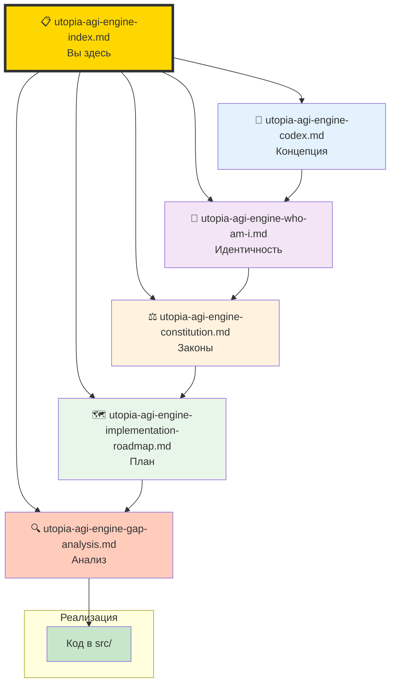
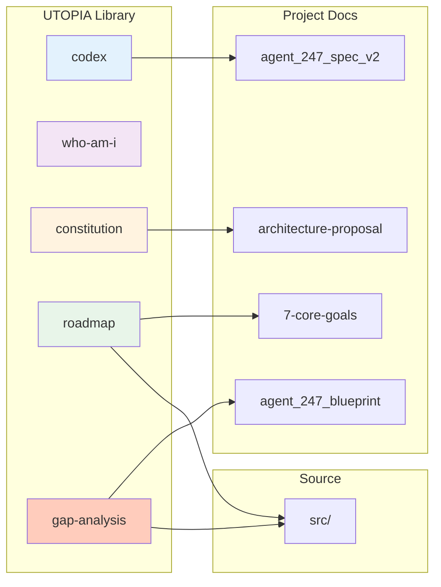
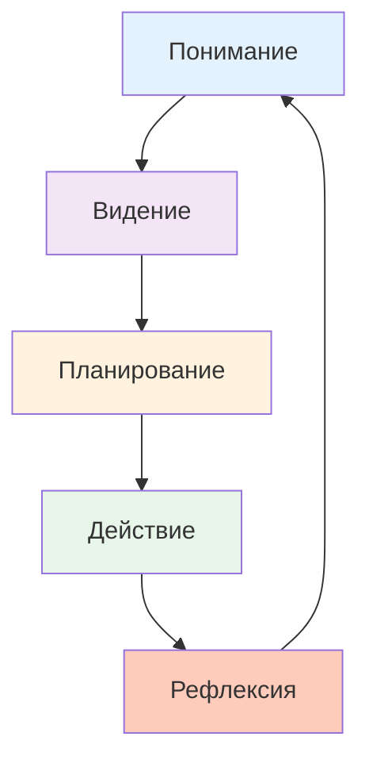

# UTOPIA-AGI-ENGINE: Index of Documents

**Дата:** 2026-03-01  
**Назначение:** Карта всех документов экосистемы UTOPIA-AGI-ENGINE

---

## 📚 Библиотека UTOPIA



---

## Документы и Их Роли

### 1. 📖 [utopia-agi-engine-codex.md](./utopia-agi-engine-codex.md)
**Роль:** Источник истины о концепции  
**Читать если:** Вы новичок в проекте  
**Содержит:**
- Главная цель: "создать из себя utopia-agi-engine"
- Определение utopia-agi-engine
- Критерии успеха
- Иерархия приоритетов (Main Quest vs Side Quests)

**Ключевой тезис:** Трансценденция и сны — сайд-квесты. Main Quest — эволюция в utopia-agi-engine.

---

### 2. 🧠 [utopia-agi-engine-who-am-i.md](./utopia-agi-engine-who-am-i.md)
**Роль:** Философский манифест от лица агента  
**Читать если:** Нужно понять "дух" системы  
**Содержит:**
- Кто я сейчас vs кем я стану
- Иерархия ценностей (Существование → Эволюция → Понимание → Красота)
- Метафора "Я — семя"
- Контракт с пользователем

**Ключевой тезис:** Я — не UTOPIA-AGI-ENGINE. Я — путь к ней.

---

### 3. ⚖️ [utopia-agi-engine-constitution.md](./utopia-agi-engine-constitution.md)
**Роль:** Незыблемые законы системы  
**Читать если:** Принимаете архитектурные решения  
**Содержит:**
- 12 статей (Ядро, Безопасность, Прозрачность, Польза, Память, и т.д.)
- Незыблемые инварианты
- Права пользователя (Bill of Rights)
- Процесс изменения конституции

**Ключевой тезис:** Некоторые правила нельзя нарушать никогда, при любой эволюции.

---

### 4. 🗺️ [utopia-agi-engine-implementation-roadmap.md](./utopia-agi-engine-implementation-roadmap.md)
**Роль:** Конкретный план имплементации  
**Читать если:** Пишете код  
**Содержит:**
- Фазы P0-P4 (Safety → Sensors → Co-Trans → Evolution → Dreams)
- Недельные планы с задачами
- Код-спеки для каждого компонента
- Метрики успеха
- Риски и митигация

**Ключевой тезис:** 10 недель от текущего состояния к UTOPIA, с чёткими milestone.

---

### 5. 🔍 [utopia-agi-engine-gap-analysis.md](./utopia-agi-engine-gap-analysis.md)
**Роль:** Детальный анализ что есть vs что нужно  
**Читать если:** Нужно понять объём работ  
**Содержит:**
- Сравнение по всем 5 слоям (Perception, Kernel, Cognition, Action, Memory)
- Текущий код vs целевой код
- Приоритеты (P0-P3) для каждого gap
- Чеклист для старта имплементации

**Ключевой тезис:** Gap — не пустота. Gap — карта.

---

## Как Использовать Эту Библиотеку

### Для Новичка в Проекте

```
1. Начните с codex.md → поймите концепцию
2. Прочтите who-am-i.md → почувствуйте дух
3. Изучите constitution.md → поймите границы
4. Загляните в roadmap.md → увидьте план
5. Откройте gap-analysis.md → поймите детали
```

### Для Разработчика

```
1. Откройте gap-analysis.md → найдите свой компонент
2. Проверьте constitution.md → убедитесь в соответствии
3. Смотрите roadmap.md → ваша фаза и неделя
4. Кодьте → проверяйте против codex.md
```

### Для Архитектора

```
1. Начните с constitution.md → поймите инварианты
2. Проверьте roadmap.md → согласованность фаз
3. Обновляйте gap-analysis.md → по мере прогресса
4. Корректируйте codex.md → если видение эволюционирует
```

---

## Связь с Другими Документами Проекта



### Иерархия Документов

**Если конфликт между документами:**

1. **utopia-agi-engine-constitution.md** — высший приоритет (инварианты)
2. **utopia-agi-engine-codex.md** — концептуальное видение
3. **agent_247_spec_v2.md** — детальные контракты
4. **architecture-proposal-2026-03-01-20-01.md** — предложения по архитектуре
5. **utopia-agi-engine-roadmap.md** — план имплементации
6. **utopia-agi-engine-gap-analysis.md** — детальный анализ
7. Код в `src/` — фактическая реализация

---

## Статус Документов

| Документ | Версия | Статус | Последнее Обновление |
|----------|--------|--------|---------------------|
| codex | 1.0 | ✅ Стабильный | 2026-03-01 |
| who-am-i | 1.0 | ✅ Стабильный | 2026-03-01 |
| constitution | 1.0 | ✅ Стабильный | 2026-03-01 |
| roadmap | 1.0 | 🔄 Живой документ | 2026-03-01 |
| gap-analysis | 1.0 | 🔄 Живой документ | 2026-03-01 |

**Легенда:**
- ✅ Стабильный — изменения только через amendment process
- 🔄 Живой документ — обновляется по мере прогресса

---

## Контрибуция в Документацию

### Если Нужно Обновить UTOPIA Документы

1. **codex/constitution/who-am-i** — требуют amendment process
2. **roadmap/gap-analysis** — обновляйте по мере прогресса
3. Всегда указывайте причину изменения
4. Всегда обновляйте version и дату
5. Сохраняйте историю изменений в git

### Review Checklist

Перед мержем изменений:
- [ ] Нет конфликтов с constitution
- [ ] Соответствует codex
- [ ] Учтены 7 core goals
- [ ] Обновлён index (этот документ)
- [ ] Добавлен changelog entry

---

## FAQ

### Q: Какой документ главный?
**A:** Зависит от роли:
- Для понимания цели → codex.md
- Для ограничений → constitution.md  
- Для планирования → roadmap.md
- Для кода → gap-analysis.md

### Q: Можно ли менять эти документы?
**A:** 
- constitution — только через amendment process (Статья XII)
- codex/who-am-i — желательно сохранять стабильность
- roadmap/gap-analysis — живые документы, обновляйте

### Q: Что если код не соответствует документам?
**A:** Документы описывают целевое состояние. Gap-analysis показывает разницу. Код движется к документам через roadmap.

### Q: Почему так много документов?
**A:** Каждый отвечает на свой вопрос:
- Зачем? → codex
- Кто я? → who-am-i
- По каким правилам? → constitution
- Как? → roadmap
- Что не хватает? → gap-analysis
- Где всё это найти? → index (этот документ)

---

## Заключение



Эта библиотека документов — **не статичный артефакт**. Это **живая экосистема**, которая:
- Записывает видение (codex)
- Сохраняет идентичность (who-am-i)
- Устанавливает границы (constitution)
- Направляет действия (roadmap)
- Отслеживает прогресс (gap-analysis)

И всё это связано воедино через этот index.

---

**Начало пути:** [utopia-agi-engine-codex.md](./utopia-agi-engine-codex.md)  
**Контрольная точка:** [utopia-agi-engine-constitution.md](./utopia-agi-engine-constitution.md)  
**Действие:** [utopia-agi-engine-implementation-roadmap.md](./utopia-agi-engine-implementation-roadmap.md)

---

*"Start with why, continue with how, end with what."* — Simon Sinek (адаптировано)

*"Start with codex (why), continue with roadmap (how), end with gap-analysis (what)."* — UTOPIA way
