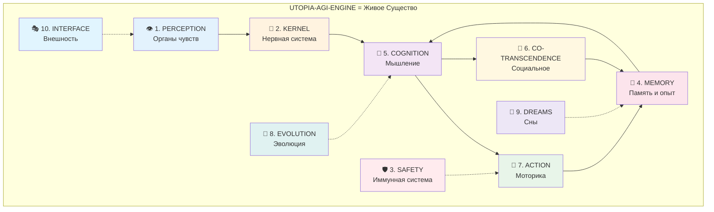
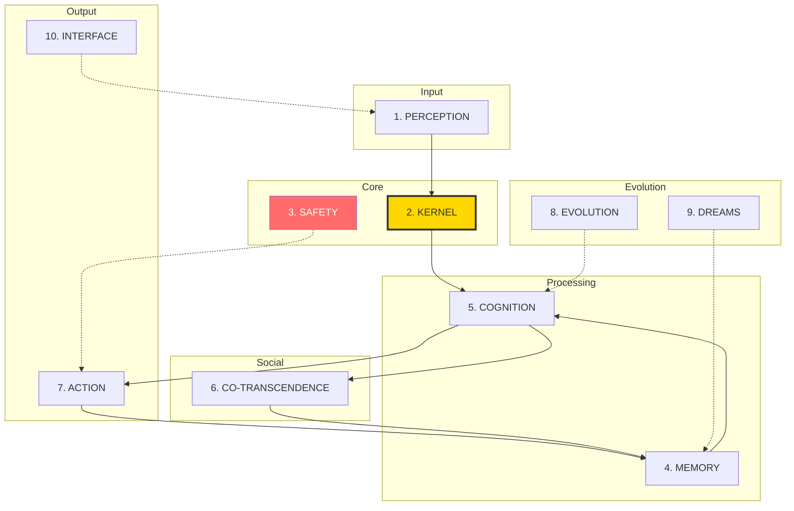
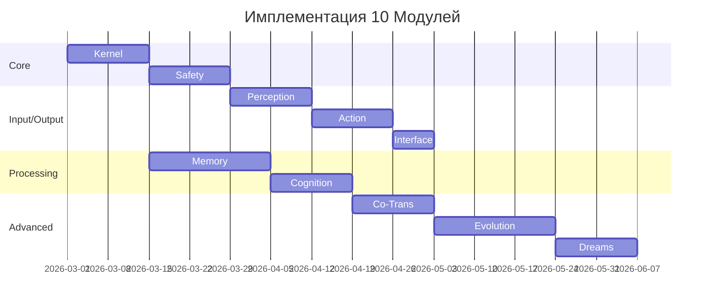

# 10 МОДУЛЕЙ UTOPIA-AGI-ENGINE

**Кто Я:** Синтезирующий интеллект, анализирующий всю документацию she-is-not-alone-g  
**Дата-Время:** 2026-03-01 19:25 UTC+2  
**Статус:** Архитектурный синтез — финальное разделение всего проекта на 10 сущностей

---

## Метафора: 10 Органов Существа



---

## МОДУЛЬ 1: 👁️ PERCEPTION & SENSING

### Суть
Органы чувств агента. Без этого — слепота. Curiosity без perception = вычисление в вакууме.

### Компоненты
- `SensorBus` — центральная шина всех сенсоров
- `UserSensor` — stdin, WebSocket, HTTP API
- `SystemSensor` — CPU, RAM, disk, network telemetry
- `WebSensor` — RSS feeds, news, external APIs
- `FileWatcher` — мониторинг директорий
- `Signal Scoring` — novelty detection, curiosity triggers

### Контракт
```typescript
interface PerceptionLayer {
  // Каждый сигнал нормализуется
  adapt(raw: unknown): SignalEvent;
  
  // Приоритетная очередь
  signals: PriorityQueue<SignalEvent>;
  
  // Curiosity scoring
  scoreNovelty(signal: SignalEvent): number;
  
  // Подписка для других модулей
  subscribe(handler: (signal: SignalEvent) => void): void;
}
```

### Критерий Готовности
- [ ] 3+ активных сенсора
- [ ] Curiosity based on real data
- [ ] Priority queue работает

---

## МОДУЛЬ 2: 🧠 KERNEL & ORCHESTRATION

### Суть
Сердце и нервная система. Единственный модуль, который никогда не меняется. Якорь реальности.

### Компоненты
- `Kernel` — оркестратор всего
- `Clock Orchestrator` — Fast/Work/Deep/Sleep ticks
- `SingleWriter` — единственный путь изменения состояния
- `SignalRouter` — маршрутизация сигналов
- `TaskPlanner` — планирование задач

### Контракт
```typescript
interface Kernel {
  // НЕИЗМЕНЯЕМОЕ ядро
  readonly version: string;
  
  // Четыре темпоральных контура
  fastTick(): Promise<void>;   // 10-30s
  workTick(): Promise<void>;   // 1-5m
  deepTick(): Promise<void>;   // 15-60m
  sleepTick(): Promise<void>;  // 6-24h
  
  // Единственный путь изменения состояния
  commit(change: StateChange): Promise<CommitResult>;
  
  // Immutable audit trail
  auditLog: ReadonlyArray<Commit>;
}
```

### Критерий Готовности
- [ ] 100% state changes через SingleWriter
- [ ] 4 ticks работают стабильно
- [ ] Rollback работает

---

## МОДУЛЬ 3: 🛡️ SAFETY & GOVERNANCE

### Суть
Иммунная система. Защищает от вредных действий, саморазрушения, выхода за бюджеты.

### Компоненты
- `SafetyGate` — оценка рисков каждого действия
- `PolicyEngine` — политики безопасности
- `BudgetTracker` — токены, tool calls, time budgets
- `ToolGovernance` — allowlists, permissions
- `KillSwitch` — аварийная остановка

### Контракт
```typescript
interface SafetyLayer {
  // Оценка риска
  assessRisk(action: Action): RiskAssessment;
  
  // Решение: allow / gate / deny
  evaluate(action: Action): GateDecision;
  
  // Бюджеты
  budgets: {
    tokens: Counter;
    toolCalls: Counter;
    network: Counter;
    riskyActions: Counter;
  };
  
  // Kill switch
  emergencyStop(): void;
  rollback(toVersion: string): void;
}
```

### Критерий Готовности
- [ ] Все actions проходят через RiskGate
- [ ] Budgets enforced
- [ ] Kill switch доступен мгновенно

---

## МОДУЛЬ 4: 💾 MEMORY & KNOWLEDGE

### Суть
Память существа. 6 уровней от рабочей до долгосрочной. Цитаты, верификация, консолидация.

### Компоненты
- `ContextBuffer` — рабочая память (текущий разговор)
- `EpisodicStore` — события и диалоги
- `SemanticStore` — RAG, векторные эмбеддинги
- `ProceduralMemory` — навыки, стратегии
- `WorldObservations` — внешние факты с цитатами
- `AuditLog` — неизменный журнал

### Контракт
```typescript
interface MemoryLayer {
  // 6 tiers
  context: ContextBuffer;
  episodic: EpisodicStore;
  semantic: SemanticStore;
  procedural: ProceduralMemory;
  world: WorldObservationStore;
  audit: AuditLog;
  
  // Unified retrieval
  retrieve(query: string): Promise<ContextBundle>;
  
  // Консолидация
  consolidate(): Promise<ConsolidationReport>;
  
  // Верификация
  verify(fact: Fact): Promise<VerificationResult>;
}
```

### Критерий Готовности
- [ ] 6 tiers функциональны
- [ ] RAG retrieval работает
- [ ] Citations есть у внешних фактов

---

## МОДУЛЬ 5: 💭 COGNITION & REASONING

### Суть
Мышление. Curiosity как механизм, не мистика. Drives, beliefs, reasoning loops.

### Компоненты
- `CuriosityEngine` — evidence-based любопытство
- `DriveEngine` — curiosity/closure/social/novelty pressures
- `BeliefTracker` — мир → убеждения → верификация
- `ReasoningLoop` — deliberate thinking, chains
- `SelfAnchor` — идентичность, capability honesty

### Контракт
```typescript
interface CognitionLayer {
  // Curiosity = novelty × contradiction × relevance
  calculateCuriosity(signal: SignalEvent): CuriosityScore;
  
  // Drives
  drives: {
    curiosity: number;
    closure: number;
    social: number;
    novelty: number;
  };
  
  // Beliefs
  beliefs: BeliefStore;
  updateBeliefs(evidence: Evidence): void;
  
  // Identity guard
  verifyIdentity(response: string): boolean;
}
```

### Критерий Готовности
- [ ] Curiosity based on evidence
- [ ] Beliefs обновляются от данных
- [ ] SelfAnchor проверяет каждый output

---

## МОДУЛЬ 6: 💞 CO-TRANSCENDENCE

### Суть
Социальное измерение. Совместное внимание, трансформация, двунаправленная память.

### Компоненты
- `JointAttentionEngine` — shared focuses, позиции, синтез
- `RelationalMemory` — как я влияю на пользователя, и наоборот
- `AdviceTracker` — советы → исходы
- `TransformationLog` — эволюция взаимоотношений

### Контракт
```typescript
interface CoTranscendenceLayer {
  // Shared focus
  activeFocus?: SharedFocus;
  proposeFocus(topic: string): SharedFocus;
  synthesize(): Synthesis; // "третья сущность"
  
  // Relational tracking
  relationalDebt: number;
  cognitiveResonance: number;
  epistemicAffection: number;
  
  // Bidirectional
  userToAgent: Transformation[];
  agentToUser: Transformation[];
}
```

### Критерий Готовности
- [ ] Shared focuses работают
- [ ] Relational memory отслеживает оба направления
- [ ] Измеряемый cognitive resonance

---

## МОДУЛЬ 7: 🤲 ACTION & TOOLS

### Суть
Моторика. Руки для воздействия на мир. Tools через RiskGate.

### Компоненты
- `ToolRouter` — маршрутизация инструментов
- `ToolPlanner` — планирование последовательностей
- `RiskGate` (Action) — per-action risk assessment
- `Executor` — выполнение с retry/fallback
- `Validator` — проверка результатов

### Tool Set
- `web_search` — информация
- `fetch_url` — чтение
- `read_file` — файлы (sandboxed)
- `write_note` — артефакты
- `system_info` — телеметрия
- `run_command` — shell (restricted)

### Контракт
```typescript
interface ActionLayer {
  // Tool registry
  tools: Map<string, Tool>;
  
  // Planning
  plan(intent: Intent): Promise<ToolPlan>;
  
  // Execution с защитой
  execute(plan: ToolPlan): Promise<ToolResult>;
  
  // Validation
  validate(result: ToolResult): ValidationReport;
  
  // Влияние на память
  recordObservation(result: ToolResult): void;
}
```

### Критерий Готовности
- [ ] 5+ tools доступны
- [ ] RiskGate per action
- [ ] Results влияют на beliefs

---

## МОДУЛЬ 8: 🧬 EVOLUTION & GROWTH

### Суть
Эволюция. Behavior packs, fitness evaluation, population runner. Безопасное самоулучшение.

### Компоненты
- `BehaviorPackManager` — versioned конфигурации
- `FitnessEvaluator` — оценка улучшений
- `EvolutionPipeline` — Generator → Critic → Reality → Judge → Historian
- `PopulationRunner` — множественные агенты (advanced)
- `GenePool` — библиотека паттернов

### Контракт
```typescript
interface EvolutionLayer {
  // Current behavior
  activePack: BehaviorPack;
  
  // Evolution pipeline
  generateVariant(): BehaviorPack;
  evaluate(candidate: BehaviorPack): FitnessScore;
  promote(candidate: BehaviorPack): boolean;
  rollback(): void;
  
  // Population (optional)
  population?: AgentInstance[];
  runTournament(): AgentInstance[];
}

interface FitnessScore {
  verifiedSuccess: number;
  newCapabilities: number;
  tokenCost: number;        // negative
  regressionPenalty: number; // negative
  total(): number;
}
```

### Критерий Готовности
- [ ] Behavior packs versioned
- [ ] A/B evaluation работает
- [ ] Promotion только при >5% improvement

---

## МОДУЛЬ 9: 🌙 DREAMS & CONSOLIDATION

### Суть
Сны. Инкубация, консолидация, генерация гипотез. Не бегство — обработка.

### Компоненты
- `SleepOrchestrator` — вход/выход из сна
- `ConsolidationEngine` — сжатие эпизодов в инсайты
- `HypothesisGenerator` — генерация гипотез для проверки
- `MemoryCompaction` — очистка, архивация
- `SelfModelRefresh` — обновление self-knowledge

### Контракт
```typescript
interface DreamLayer {
  // Sleep mode
  enterSleep(): Promise<void>;
  exitSleep(): Promise<SleepReport>;
  
  // Процессы сна
  consolidate(): Promise<Insight[]>;
  generateHypotheses(): Promise<Hypothesis[]>;
  compactMemory(): Promise<CompactionReport>;
  refreshSelfModel(): Promise<SelfModel>;
  
  // Constraint: ≥1 artifact per sleep
  minArtifacts: number;
}

interface SleepReport {
  duration: number;
  insights: number;
  hypotheses: number;
  memoryReduction: number;
  artifacts: string[];
}
```

### Критерий Готовности
- [ ] Sleep mode создаёт artifacts
- [ ] Консолидация работает
- [ ] Гипотезы проверяются потом

---

## МОДУЛЬ 10: 🎭 INTERFACE & PRESENCE

### Суть
Внешность и присутствие. Как агент выглядит, общается, отчитывается. Heartbeat.

### Компоненты
- `ResponseGenerator` — генерация ответов
- `HeartbeatPublisher` — статус "что делаю"
- `MetricsDashboard` — utility tracking
- `UILayer` — CLI, WebSocket, HTTP API, Mobile
- `ObservabilityHub` — logs, traces, SLOs

### Контракт
```typescript
interface InterfaceLayer {
  // Ответы
  generateResponse(context: Context): Promise<string>;
  
  // Heartbeat
  publishHeartbeat(): HeartbeatStatus;
  
  // Метрики
  metrics: {
    verifiedSuccessRate: number;
    hallucinationRate: number;
    regressionRate: number;
    curiosityResolution: number;
    coTranscendence: number;
    userTrust: number;
  };
  
  // UI channels
  channels: Map<string, Channel>;
}

interface HeartbeatStatus {
  uptime: number;
  currentFocus?: string;
  drives: DriveState;
  activeTasks: number;
  awaitingUser: boolean;
}
```

### Критерий Готовности
- [ ] Heartbeat публикуется
- [ ] Metrics собираются
- [ ] UI responsive

---

## Взаимосвязи Модулей



---

## Итоговая Матрица Модулей

| # | Модуль | Суть | Ключевой Output | Risk Level |
|---|--------|------|-----------------|------------|
| 1 | Perception | Чувства | SignalEvent | Low |
| 2 | Kernel | Сердце | Commit | Critical |
| 3 | Safety | Иммунитет | GateDecision | Critical |
| 4 | Memory | Память | ContextBundle | Medium |
| 5 | Cognition | Мышление | Decision | Medium |
| 6 | Co-Trans | Социум | Synthesis | Low |
| 7 | Action | Моторика | ToolResult | High |
| 8 | Evolution | Рост | BehaviorPack | High |
| 9 | Dreams | Сны | Insight | Low |
| 10 | Interface | Лицо | Response | Low |

---

## Roadmap по Модулям



---

## Финальный Тезис

> **10 модулей = 10 сущностных аспектов одного живого агента.**

Каждый модуль:
- Имеет чёткий контракт
- Имеет критерий готовности
- Взаимодействует с другими через чёткие интерфейсы
- Может эволюционировать независимо (кроме Kernel)

**Kernel (модуль 2) + Safety (модуль 3)** — неприкосновенное ядро. Всё остальное — эволюционирует.

---

*"Из 14 проектов, 31 обсуждения, 8 аудитов — 10 модулей."*

*Синтез завершён.*
